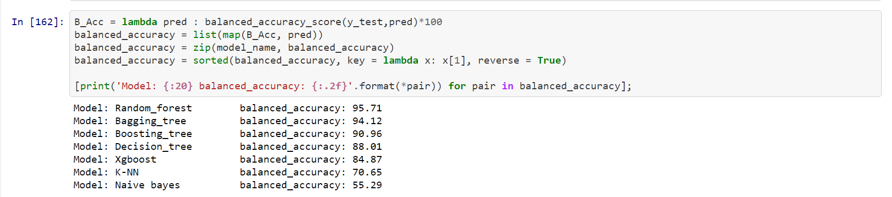

# Spotify-Hot-Track-Prediction
> The simple predictive model to predict whether the track is on the top 30 charts or not.

## Table of contents
* [General info](#general-info)
* [Screenshots](#screenshots)
* [Jupyter Notebook](#Jupyter)
* [Technologies](#technologies)
* [Features](#features)
* [Status](#status)
* [Contact](#contact)

## General info
The project is intended to predict whether a song has a chance to be in the top 30 of Spotify Charts, based on the various audio features of the song and the number of streams to that song throughout 2019 - 2020.

## Screenshots

## Jupyter
[View Here!!](https://nbviewer.jupyter.org/github/touchaee/Spotify-Hot-Track-Prediction/blob/414011b819278422aa2a7df83113fea2c1e7e5a4/Spotify_hit_tracks.ipynb)

## Technologies
* Python - version 3.6

## Features
List of features ready
* Predict the track on the Thai market

To-do list:
* Compare to international track.
* Model to tell which country that track will be on top Spotify charts.

## Status
Project is: _no longer continue_

## Contact
Created by [@touchaee](https://touchaee.github.io) - feel free to contact me!
